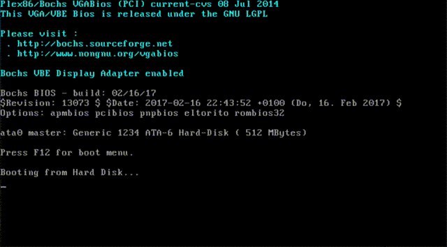

# Krabs: x86 bootloader
Krabs is an experimental x86/x86_64 bootloader written in Rust.  
Krabs can boot the ELF formatted kernel (like vmlinux) which compressed with bzip2. Krabs
decompresses the bz2 image and relocate the ELF image, then boot the kernel.

Some of the source code uses libbzip2 C library for decompressing, but the rest
is completely Rust only.

## What is Krabs?
Krabs is working on booting vmlinux and other kernels formatted in ELF on
32-bit/64-bit PCs and is under the development.  
Krabs also aims to support only the minimal Linux x86/x86_64 boot protocol. This allows you
to specify the kernel command line and initrd/initramfs.  
Another feature is that in order to save space, use bzip2 compressed images instead of raw ELF. Krabs uses libbzip2 library for decompressing it.

## News
2020/02/17:
* kernel command line and initrd works fine. Below is an [example](docs/linux-image-setup-64.md):

```shell
$ ./tools/burger.sh -b
$ ./tools/burger.sh -k vmlinux -i initramfs.cpio.gz -p "clocksource=tsc" disk.img 
$ qemu-system-x86_64 --hda disk.img
```



2020/03/15:
* [Krabs ran fine on the Thinkpad 600X!](https://twitter.com/o8_vm/status/1275473115980558336?s=20) Linux 5.4 is booted fine by Krabs. The kernel command line is also recognized.

## Getting Started
To get started with Krabs, build it from source.

### Requirements
You need a nightly Rust compiler,
[cargo-xbuild](https://github.com/rust-osdev/cargo-xbuild) and [cargo-binutils](https://github.com/rust-embedded/cargo-binutils).  
The `-c` option of `tools/burger.sh` checks for the exists of those required programs,
and installs them that can be installed with cargo:

```shell
$ git clone https://github.com/ellbrid/krabs.git
$ cd /path/to/krabs
$ ./tools/burger.sh -c
== check commands ==
    commands check passed

== check components & install ==
    xbuild installed
    cargo-binutils installed
    llvm-tools-preview installed
    rust-src installed
```

If you are using 64-bit Linux, 32-bit multilib environment is needed:

```shell
RHEL/CentOS:
$ sudo yum install -y glibc.i686 glibc-devel.i686 libgcc.i686
Ubuntu:
$ sudo apt install gcc-multilib -y
```

For testing, you also need the qemu and MBR disk image.   
Disk image should have a bootflaged partition.

```shell
$ qemu-img create disk.img 100M
$ fdisk disk.img # create requiresd partitions
$ fdisk -l disk.img
...
Disklabel type: dos
Disk identifier: 0xef2cad51

Device     Boot Start    End Sectors  Size Id Type
disk.img1  *     2048  10000    7953  3.9M 83 Linux
disk.img2       10240 204799  194560   95M 83 Linux
```

### Build
You can build Krabs as follows:

```shell
cd /path/to/krabs
./tools/burger.sh -b
```

### Write
Write out to the disk:

```shell
./tools/burger.sh -k [ELF_kernel_file] -i [initrd_file] -p "kernel command line" disk.img
```

krabs will be installed into disk.img.   
The `-k`, `-i`, and `-p` options are not required.

### Run
You can test it using QEMU:  

```shell
qemu-system-x86_64 --hda disk.img
```

## Examples 
Simple examples are described in [the example document](docs/example.md).  
This is also a quickstart guide and should be read.

Examples for x86-64 Linux is described in
[the docs of 'Creating Custom Linux Images and Booting'](docs/linux-image-setup-64.md).

## Contributing
Krabs welcomes all contributions.

To contribute to Krabs, check out the [getting started guide](#getting-started)
and then the Krabs [contribution guidelines](CONTRIBUTING.md).

## Design
Krabs's overall architecture is described in
[the design document](docs/design.md) and
[the specification document](docs/specifications.md).

## Features
1. Supports legacy BIOS.
2. Supported media are HDD and SSD which have MBR.
3. Supports 32bit protected mode and 64bit long mode. 
4. Supports OS kernel formatted in ELF32/ELF64.
5. Supports minimal
[x86/x86_64 linux boot protocol](https://www.kernel.org/doc/html/latest/x86/boot.html). 
6. To save space, OS kernels is compressd with bzip2 before use. When loading, Krabs
unpacks it.
7. An area of ​​120 bytes is reserved for the kernel command line.
Using this area, Krabs can transmit parameters to the OS, and can manipulate the
behavior of the kernel at startup.
8. Krabs can load modules such as initramsfs/initrd according to 
[x86/x86_64 linux boot protocol](https://www.kernel.org/doc/html/latest/x86/boot.html).

## License
This project is licensed under either of

* Apache License, Version 2.0, ([LICENSE-APACHE](LICENSE-APACHE) or
   http://www.apache.org/licenses/LICENSE-2.0)
* MIT license ([LICENSE-MIT](LICENSE-MIT) or
   http://opensource.org/licenses/MIT)

at your option.

Unless you explicitly state otherwise, any contribution intentionally submitted
for inclusion in Serde by you, as defined in the Apache-2.0 license, shall be
dual licensed as above, without any additional terms or conditions.

## Contanct
You can get in touch with me in the following ways:

* Contact me on my [twitter](https://twitter.com/o8_vm).
* Open a GitHub issue in this repository.
* Email me at [o8@vmm.dev](mailto:o8@vmm.dev).

_Note: I'm on a Japan time zone._  

When communicating within the Krabs community, please mind our
[code of conduct](CODE_OF_CONDUCT.md).