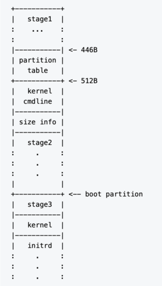

# Krabs Design

## Scope

### What is Krabs
Krabs is an experimental x86 bootloader written in Rust.  
Krabs can boot the ELF formatted kernel which compressed with bzip2. Krabs
decompresses the bz2 image and relocate the ELF image, then boot the kernel.

### Features
1. Supports legacy BIOS.
2. Supported media are HDD and SSD which have MBR.
3. Supports 32bit protected mode and 64bit long mode. 
4. Supports minimal
[x86/x86_64 linux boot protocol](https://www.kernel.org/doc/html/latest/x86/boot.html).
5. Supports OS kernel formatted in ELF32/ELF64.
6. To save space, OS kernels is compressd with bzip2 before use. When loading, Krabs
unpacks it.
7. An area of ​​122 bytes is reserved for the kernel command line.
Using this area, Krabs can transmit parameters to the OS, and can manipulate the
behavior of the kernel at startup.
8. Krabs can load modules such as initramsfs/initrd according to 
[x86/x86_64 linux boot protocol](https://www.kernel.org/doc/html/latest/x86/boot.html).

### Specifications
Krabs's technical specifications are available in
[the Specifications document](specifications.md).
Krabs supports only the minimal
[x86 Linux boot protocol](https://www.kernel.org/doc/html/latest/x86/boot.html).
So your OS needs to use this as well.  
Read more about it in [the Specification document](specifications.md).

## How Krabs works
The minimum requirement for booting an ELF-formatted kernel is that the kernel
image must be parsed and loaded to the address specified in the program header.
In this project, the following four types of initialization processing are
performed.

**Hardware initialization:**
* Setting the keyboard repeat rate.
* Disable interrupts and mask all interrupt levels.
* Setting Interrupt descriptor (IDT) and segment descriptor (GDT). As a result,
all selectors (CS, DS, ES, FS, GS) refer to the 4 Gbyte flat linear address
space.
* Change the address bus to 32 bits (Enable A20 line).
* Transition to protected mode.
* If the target is ELF64, set the 4G boot pagetable and transition to long mode.

**Software initialization:**
* Get system memory by BIOS call.

**Information transmission to the kernel:**
* Setting [Zero Page](https://www.kernel.org/doc/html/latest/x86/zero-page.html)
of kernel parameters and transmit it to the OS.

**Relocate the kernel:**
* The target is an ELF file, but Krabs uses it after bzip2 compression.
Therefore, two-stage relocation is needed. One is bzip2 decompression and the
other is ELF relocation.

## Structure and Overview
1. stage1  
A 446 byte program written to the boot sector. The segment
registers(CS, DS, ES, SS) are set to `0x07C0`, and the stack pointer (ESP) is
initialized to `0xFFF0`. After that, stage2 is loaded to address
`0x07C0:0x0200`, and jumps to address `0x07C0:0x0280`. In the latter half of
stage1, there is an area for storing the sector length (in units of 512 bytes)
of the stage2 program.
2. stage2  
The stage3 program is loaded at address `0x07C0:0x6000`, the compressed kernel
image is loaded at address `0x0350_0000` in the extended memory area, and the
initrd file is loaded at `0x0560_0000`. The file is read from the disk using a
4K byte track buffer from address `0x07C0:0xEE00`, and further transferred to an
appropriate address using `INT 15h` BIOS Function `0x87h`. When the loading of
stage3, initrd and compressed kernel image is completed, jump to address
`0x07C0:0x6000`.
The kernel command line is held in the area of 122 bytes from address `0x280`.
3. stage3 + stage4  
Stage3 + Stage4 is linked with the libbzip2 decompression routine. Since an
external C library is used, it is necessary to support zero clear of the .bss
section. After a series of hardware and software initialization, empty_zero_page
information is prepared in `0x07C0:0x0000` to `0x07C0:0x0FFF` together with the
information written in stage2. Enable the A20 line, change the address bus to 32
bits, and shift to the protect mode. The decompression function is called, the
bzip2 compressed ELF kernel image is restored to the extended memory address
`0x100000` or later, and then the ELF32/ELF64 file is parsed and loaded. If the
target is ELF64, set the 4G boot pagetable and transition to long mode. Finally,
jump to the entry point to launch the kernel. At this time, it is necessary to
put the physical address (`0x00007C00`) of the empty_zero_page information
prepared in the low-order memory into the ESI or RSI register.
4. plankton🦠  
library common to stage1 ~ stage4.

## Disk Space Layout
bootflaged partition is needed. Set boot flag on 1st partition:

