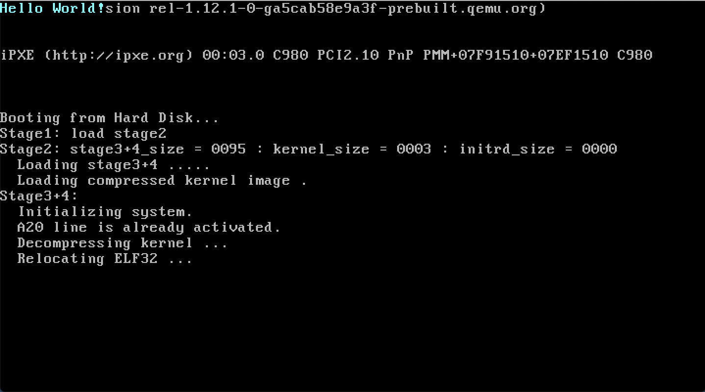
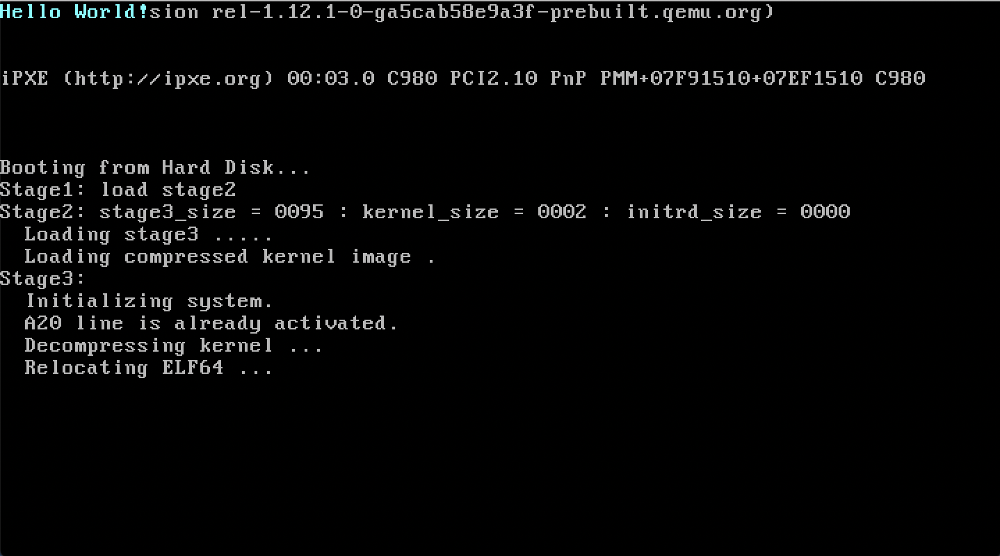

# Examples
Build and launch a simple kernel that only displays Hello world.

## ELF32 example (protect mode)

```shell
$ pwd
path/to/krabs
$ cd resources/eg-kernel
$ cargo xbuild --release
$ cd path/to/krabs
$ ./tools/burger.sh -b
$ ./tools/burger.sh -k resources/eg-kernel/target/i586-example_os/release/eg-kernel resources/test.img 
$ qemu-system-i386 resources/test.img -boot c
```

screenshot:



## ELF64 example (long mode)

```shell
$ pwd
path/to/krabs
$ cd resources/eg-kernel
$ cargo xbuild --release
$ cd path/to/krabs
$ ./tools/burger.sh -b
$ ./tools/burger.sh -k resources/eg-kernel64/target/x64-example_os/release/eg-kernel resources/test.img 
$ qemu-system-x86_64 resources/test.img -boot c
```

screenshot:

