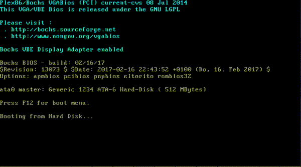

# Creating Custom Linux Images and Booting
Create custom Linux images and boot it with Krabs.
This example needs to be run on Linux.

1. Build a vmlinux
3. Create a initramfs
2. Create a Disk Image
4. Boot the custom linux image with Krabs

## Build a minimal vmlinux
1. Get the Linux source code:
   ```shell
   wget https://cdn.kernel.org/pub/linux/kernel/v5.x/linux-5.5.2.tar.gz
   tar xf linux-5.5.2.tar.gz 
   cd linux-5.5.2
   ```
2. Configure your Linux build according the following:
   ```shell
   make allnoconfig
   make menuconfig
   ```
   ```
   64-bit kernel ---> yes
   General setup ---> Initial RAM filesystem and RAM disk (initramfs/initrd) support ---> yes
   General setup ---> Configure standard kernel features ---> Enable support for printk ---> yes
   Executable file formats / Emulations ---> Kernel support for ELF binaries ---> yes
   Executable file formats / Emulations ---> Kernel support for scripts starting with #! ---> yes
   Enable the block layer ---> yes
   Device Drivers ---> Generic Driver Options ---> Maintain a devtmpfs filesystem to mount at /dev ---> yes
   Device Drivers ---> Generic Driver Options ---> Automount devtmpfs at /dev, after the kernel mounted the rootfs ---> yes
   Device Drivers ---> Character devices ---> Enable TTY ---> yes
   Device Drivers ---> Character devices ---> Serial drivers ---> 8250/16550 and compatible serial support ---> yes
   Device Drivers ---> Character devices ---> Serial drivers ---> Console on 8250/16550 and compatible serial port ---> yes
   Device Drivers ---> Block devices ---> yes
   Device Drivers ---> PCI Support --> yes
   Device Drivers ---> Serial ATA and Parallel ATA drivers (libata) ---> yes
   Device Drivers ---> Serial ATA and Parallel ATA drivers (libata) ---> Intel ESB, ICH, PIIX3, PIIX4 PATA/SATA support ---> yes
   Device Drivers ---> Serial ATA and Parallel ATA drivers (libata) ---> Generic ATA support ---> yes   
   Device Drivers ---> SCSI device support ---> SCSI disk support
   File systems ---> The Extended 4 (ext4) filesystem ---> yes
   File systems ---> Pseudo filesystems ---> /proc file system support ---> yes
   File systems ---> Pseudo filesystems ---> sysfs file system support ---> yes
   ```
   Or Copy the [my recommended config](../resources/.config) to `.config`, then
   do the menuconfig for adjustments:
   ```shell
   wget https://raw.githubusercontent.com/ellbrid/krabs/master/resources/.config -O .config
   make menuconfig
   ```
3. Build the vmlinux:
   ```shell
   make vmlinux
   ```
4. You can find vmlinux under current directry as `./vmlinux`.

## Create a initramfs
1. Start off by creating basic `./src/initramfs` directory:
   ```shell
   cd ..
   mkdir --parents src/initramfs/{bin,dev,etc,lib,lib64,mnt/root,proc,root,sbin,sys}
   ```
2. Copy basic device nodes(null, console, tty, sda1, sda2 ...) from the root
filesystem to the initramfs example location:
   ```shell
   sudo cp --archive /dev/{null,console,tty,tty[0-4],sda,sda[1-8],mem,kmsg,random,urandom,zero} src/initramfs/dev/
   ```
3. Instead of using some core tools like sh and mount, we can get them from
busybox:
   ```shell
   curl -L 'https://www.busybox.net/downloads/binaries/1.31.0-defconfig-multiarch-musl/busybox-x86_64' > src/initramfs/bin/busybox
   sudo chmod +x src/initramfs/bin/busybox
   ./src/initramfs/bin/busybox --list | sed 's:^:src/initramfs/bin/:' | xargs -n 1 ln -s busybox
   ```
4. We'll also need an init script. example:
   ```shell
   cat >> src/initramfs/init << EOF
   #!/bin/sh

   mount -t devtmpfs  devtmpfs  /dev
   mount -t proc      proc      /proc
   mount -t sysfs     sysfs     /sys
   sleep 2
   cat <<END


   Boot took $(cut -d' ' -f1 /proc/uptime) seconds
                                                
   _____           _        __    _             
   |   __|___ ___ _| |_ _   |  |  |_|___ _ _ _ _ 
   |__   | .'|   | . | | |  |  |__| |   | | |_'_|
   |_____|__,|_|_|___|_  |  |_____|_|_|_|___|_,_|
                     |___|                       


   Welcome to Sandy Linux


   END
   exec sh
   ```
   ```shell
   sudo chmod +x src/initramfs/init
   ```
5. Now to create the the initramfs:
   ```shell
   cd src/initramfs
   find . | cpio -o -H newc | gzip > ../../initramfs.cpio.gz
   ```

## Create a Disk Image
1. Create an image file with qemu:
   ```shell
   qemu-img create disk.img 512M
   ```
2. Partition with fdisk:
   ```shell
   fdisk disk.img 
   ```
   1st partition:
   ```
   Command (m for help): n
   Partition type:
      p   primary (0 primary, 0 extended, 4 free)
      e   extended
   Select (default p): p
   Partition number (1-4, default 1): 1
   First sector (2048-1048575, default 2048): 2048
   Last sector, +sectors or +size{K,M,G} (2048-1048575, default 1048575): 206848
   Partition 1 of type Linux and of size 100 MiB is set
   ```
   bootflaged partition is needed. Set boot flag on 1st partition:
   ```
   Command (m for help): a
   Selected partition 1
   ```
   2nd partition:
   ```
   Command (m for help): n
   Partition type:
      p   primary (1 primary, 0 extended, 3 free)
      e   extended
   Select (default p): p
   Partition number (2-4, default 2): 
   First sector (206849-1048575, default 208896): 
   Using default value 208896
   Last sector, +sectors or +size{K,M,G} (208896-1048575, default 1048575): 
   Using default value 1048575
   Partition 2 of type Linux and of size 410 MiB is set
   ```
   write out:
   ```
   Command (m for help): w
   The partition table has been altered!
   Syncing disks.
   ```
3. Create ext4 on the second partition.
   ```shell
   sudo kpartx -av disk.img 
   lsblk
   NAME            MAJ:MIN RM  SIZE RO TYPE MOUNTPOINT
   sr0              11:0    1 1024M  0 rom  
   loop0             7:0    0  512M  0 loop 
   ├─loop0p1       253:2    0  100M  0 part 
   └─loop0p2       253:3    0  410M  0 part 
   sudo mkfs.ext4 /dev/mapper/loop0p2
   sudo kpartx -d disk.img 
   ```

## Boot the custom linux image with Krabs
Just execute the following command.  
`build.sh` compress the vmlinux with bzip2 and writes it into disk.img:
```shell
$ pwd
path/to/krabs
$ ./tools/burger.sh -b
$ ./tools/burger.sh -k path/to/vmlinux -i path/to/initramfs.cpio.gz -p "clocksource=tsc" path/to/disk.img 
```

## DiskSpace layout


## Working Example
Use qemu:
```shell
qemu-system-x86_64 --hda disk.img -m 1G
```

_Note: you shoud select 1G or more. Otherwise, OOM may occur._

